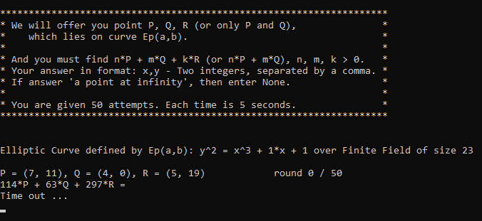
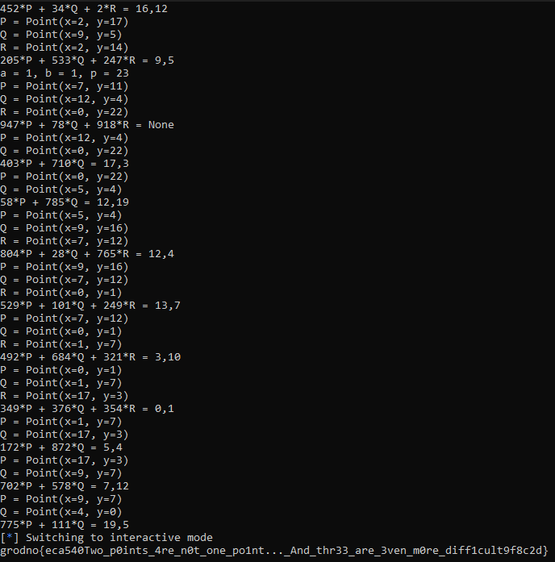

First of all, I start interacting with the socket connection provided via `ctf.mf.grsu.by 9028`.

And by further analysis, I realized that it was nothing than a problem related to ECC computation especially adding points and multiplying a point by a scalar.

I got grisp with that knowledge on [cryptohack](https://cryptohack.org/). So, I just reuse the script from that platform and re-adapted it so as to solve the challenge.

And, the flag was **grodno{eca540Two_p0ints_4re_n0t_one_po1nt..._And_thr33_are_3ven_m0re_diff1cult9f8c2d}**.