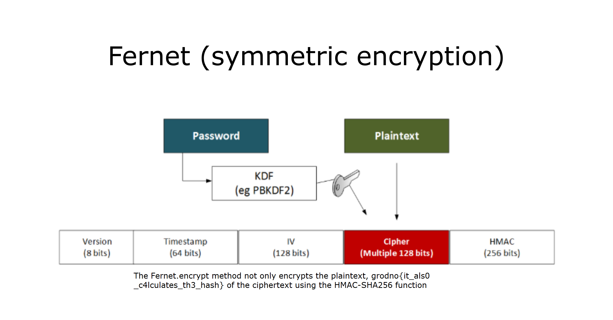

This challenge was related to _Fernet Encryption_.

Using [**_cocktail.txt_**](./dist/cocktail.txt), I got the key used.

I then used that key to decrypt [**_file.xxx_**](./dist/file.xxx).

And I got an image file on which was written the flag.

And the flag was : **grodno{it_als0_c4lculates_th3_hash}**.