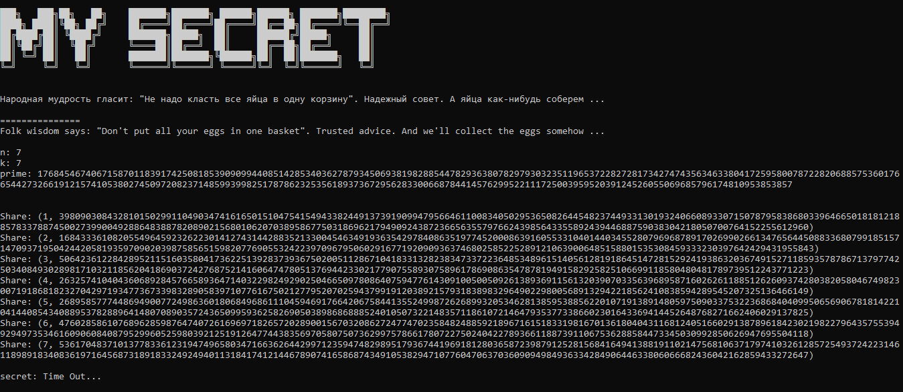
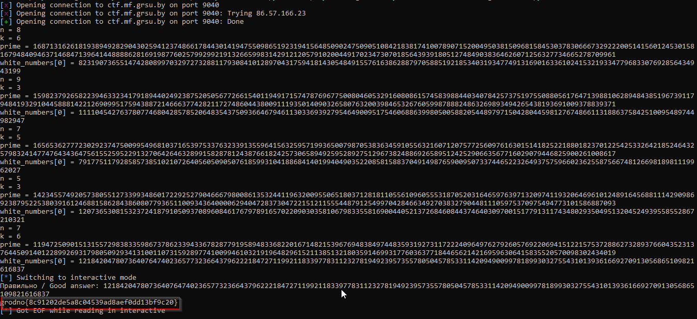

First of all, I start interacting with the socket connection provided via `ctf.mf.grsu.by 9040`.

And by further analysis, I realized that it was nothing than a simple matrix computation problem.

`([(x ** i) for i in range(k)] % prime) * coefficients = [share[1] for share in shares]`

`                (n, k)                 *    (k, 1)    =             (n,1)             `

Based on that, I do an adaptation of my [code](./solve/wu.py) so as to compute the modular inverse of a squared and non-squared shares.

And, the flag was **grodno{7cad302de5a8c04539ad8aef0dd136f6c2f}**.