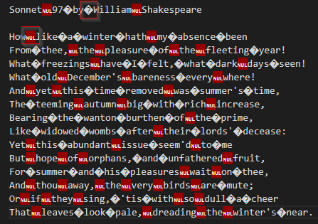
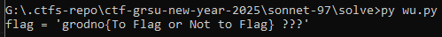

This challenge was solved after the ctf event.

Looking carrefully at the [original file](./dist/sonet_97_by_William_Shakespeare.txt) content, I noticed that there are two suspicious characters : **_\x00_** (a null byte) and **_\xa0_**.

That gave me a clue related to binary encoding. I assumed that the **_NULL BYTE_ will probe for _0_** and **the other one will probe for _1_.**

So, I wrote a [python script](./solve/wu.py) to get the flag.

And luckily, I got it : **grodno{To Flag or Not to Flag}**.