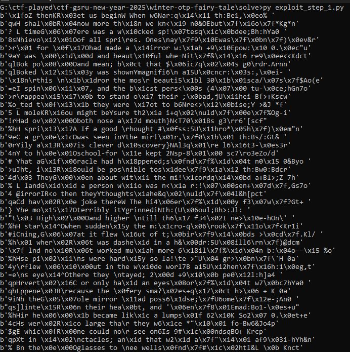
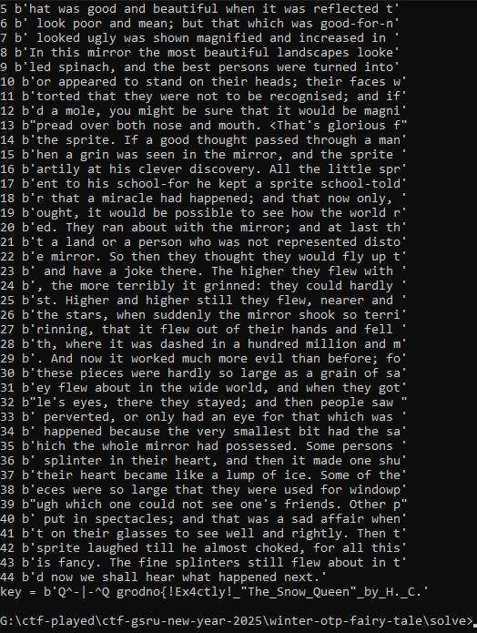

Reading the chall description and taking a closer look at **_cipher.txt_**, I go to the conclusion that we were in a **many times pad** context.

So, first of all, I use a [script](./solve/exploit_step_1.py) so as to reveal some plaintext informations from those ciphertexts.

With that, I did a lot of guessing so as to recover the key because according to the challenge description, the lag was in the key used.

I then wrote another [script](./solve/exploit_step_2.py), reajusted and run it many times so as to recover the **key** which contained a portion of the flag `Q^-|-^Q grodno{!Ex4ctly!_"The_Snow_Queen"_by_H._C.`.

I though it was the final flag, and submitted it without success.

Talking with one of my team-mates, he told me to pay attention to the content within that key : `!Ex4ctly!_"The_Snow_Queen"_by_H._C.`.

So, I embarked on an incredible journey of OSINTing 😁. And finally, I found the [story-source](https://freekidsbooks.org/the-snow-queen/#google_vignette) where probably the author extracted the text for this challenge.

I found that _"The Snow Queen"_ was a fairy tale written by _Hans Christian Andersen_.

By diving deeper and deeper, I discovered that it remained 10 character to the key so as to recover the entire flag. I was even able to think like the author of that challenge (take a look at [this file](./solve/back_to_author_thoughts.py)).

And, by pure guessing, I got the flag : **grodno{!Ex4ctly!_"The_Snow_Queen"_by_H._C._Andersen}***.