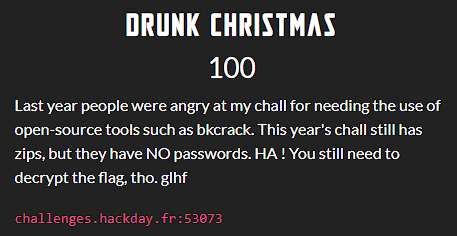
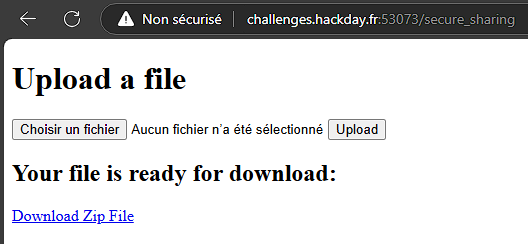

Here's the challenge description

Then I started interacting with the socket.

The zip file contained 3 files:
- the ciphertext content of the file we submitted
- the flag's ciphertext
- and a README.md file containing this text: **Please use the decoding script to recover your data. If you don't have it, then git gut.**.

First of all, I searched the internet, github repositories, _Drunk Christmas Cipher_, _Santa decoding script_ and the like, but found nothing interesting after a few hours.

After that, I decided to take a closer look at the contents of the zip file. Maybe those ciphertexts contain a clue I can use to retrieve the decoding script or maybe the plaintext of the flag as the pattern seems to be a **_KNOWN PLAINTEXT ATTACK_** to exploit.

After much trial and error, I focused on a strategy to exploit **_KNOWN PLAINTEXT ATTACK_** and noticed this:
- the cipher output changes every time the socket is interacted with. Perhaps a seed linked to the current timestamp is being used? ???
- the length of the ciphertext is almost the same as that of the plaintext
- the same inputs produce the same outputs per session
- if P2 is part of P1, then C2 is part of C1.

So I used the latest discovery to retrieve the flag.

Since I know the model, I simply wrote a [python script](solve/wu.py) to facilitate the process of obtaining the flag.

After a few minutes, I got the flag and it was: **HACKDAY{Simple_Secrets_For_Weak_Cipher_1134567892}**.