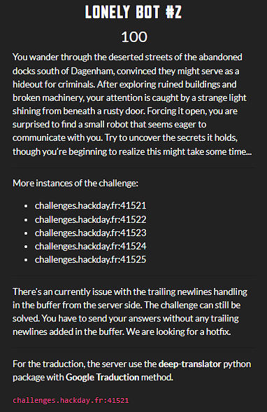

This challenge came in three variants: **_Lonely Bot #1_**, **_Lonely Bot #2_** and **_Lonely Bot #3_**.

One of my teammates solved **_Lonely Bot #1_** and **_Lonely Bot #3_**. As for me, I only worked on **_Lonely Bot #2_**.

Basically, you had to:
- beat the bot at Rock-Paper-Scissors (my approach here was far from optimal, but to have a chance of winning, I had to execute the written code several times),
- then, beat the bot at Guess-The-Number (here, I used the dichotomy method based on the Divide-and-Conquer principle),
- and finally, translate the text for the bot (here I used the **_GoogleTranslator_** module from the **_deep-translator_** Python package).

And I got the flag at the end : **HACKDAY{So0ooOOo0_KNOW|LED,GE4BLE}**.