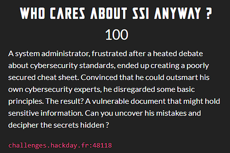

This was about **_SIDE-CHANNEL TIMING ATTACKS_**.

First, we need to determine the correct flag length.

Next, we need to examine the timing responses to determine the correct flag characters.

One thing to note is that a correct character will take less time to process than incorrect characters.

On this basis, I wrote a [python script](solve/wu.py) to solve this problem.

Fortunately, I got the flag: **HACKDAY{TIM3_t0_FlAg}**.