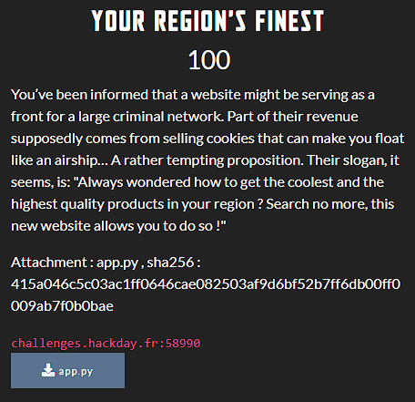

This challenge comes with a [file](dist/app.py).

One of my teammates almost did the job but got stuck somewhere. His work helped me better understand what to do and the overall contents of [app.py](dist/app.py).

Here's what to do:
- recover the secret of the jwt token so as to be able to easily tamper with the data quoted **_favorite_product_**
- **_favorite_product_** is vulnerable to **SQLi (SQL injection)**, so we need to exploit it to dump the flag.

The last part was a bit tricky as I had to find a good payload. But thank God I found it and put it all together in a [python script](solve/wu.py).

With a bit of luck, I got the flag: **HACKDAY{Th4t_s_S0m3_g000000000000d_qu4lity!}**.