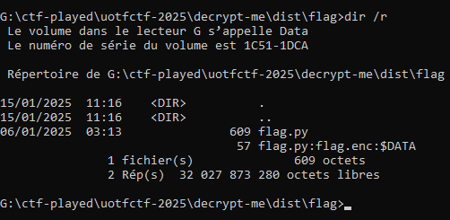
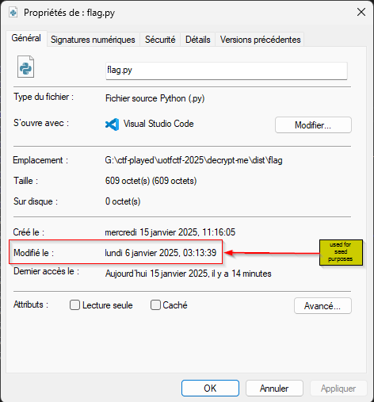

My team-mates have already done the work.

I just came at the last step.

We were given a rar file.

That file was password-protected and the pass was _toronto416_.

Decrypting it, we got a folder containing _flag.py_.

By further analisys, one of my team-mates found the _encrypted-data_ in A.D.S. (**_Alternate Data Stream_**).

So, we extract it.

What have I done yet was simply reversing the code within **_flag.py_** with **_flag.py:flag.enc:$DATA_**.

The trick here `random.seed(int(time()))` was to extract _the modification date time of **flag.py**_ so as to recover the `seed` to get the correct `KEY`.

And the flag was : **uoftctf{ads_and_aes_are_one_letter_apart}**.