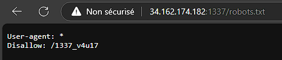
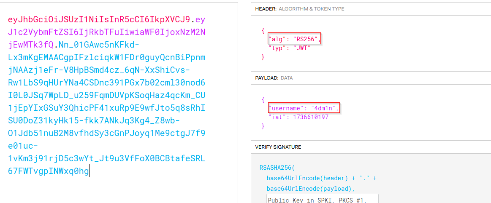
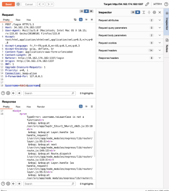
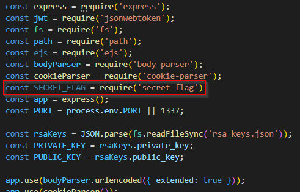
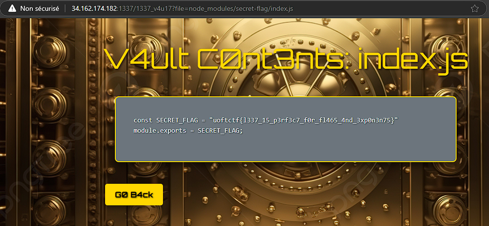

Once again, I just acted at the last step 😅.

Inspecting **_/robots.txt_**, we found a disallowed endpoint **_/l337_v4u17_**.

One of my team-mates managed to bypass the **401 error code**.

So, he tried to login and discover that a JWT token was bound to a connected user. And we have to login as admin so as to bypass that error code.

So he modified the username value to _4dm1n_. But nothing happened. We still need to have the correct key so as to face the signature issue.

He also managed to recover that RSA public key. And I help him reconstruct the associated private key.

With that, he found that the endpoint **_/l337_v4u17_** has a parameter **_?file=..._** which is vulnerable to **LFI (Local File Inclusion)**.

That friend was really amazing 🙇🤗🙇. Let me tell you that he also make the server leaks information about its files especially a precious one named : **_5up3r_53cur3_50urc3_c0d3.js_**.

With all of this, we recovered the content of [5up3r_53cur3_50urc3_c0d3.js](./solve/5up3r_53cur3_50urc3_c0d3.js) and found that the flag was retrieved from a _custom JS module_.

From that moment we started thinking like a developer, starting looking for files like _package.json_ and _package-lock.json_. Cause thoses files were present, we assumed that surely, there should be a **_node_modules_** folder and that we should exploit it so as to get the flag.

Locally, we set up a JS project so as to get more familiar with the structure of the **_node_modules_** folder.

And that's where an idea came in our mind and we tested it and it worked !!!

